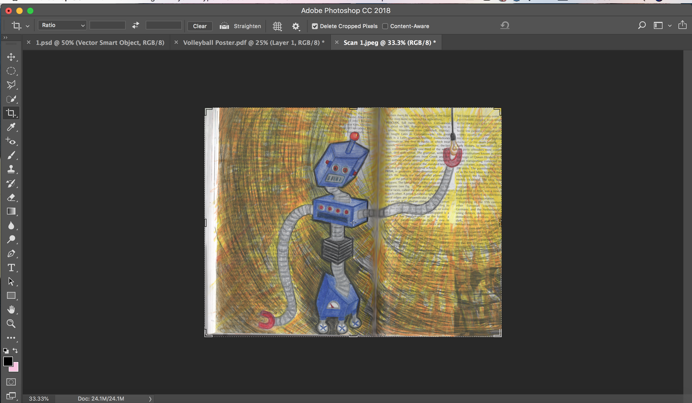
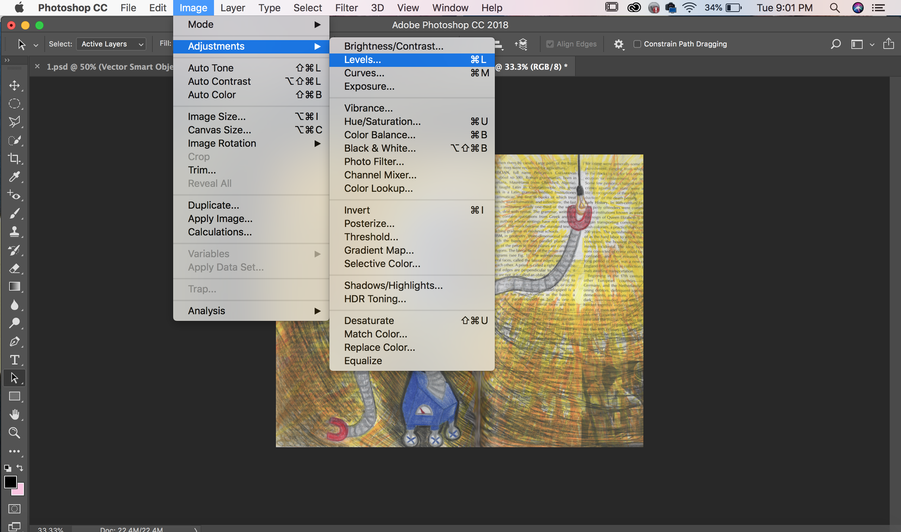
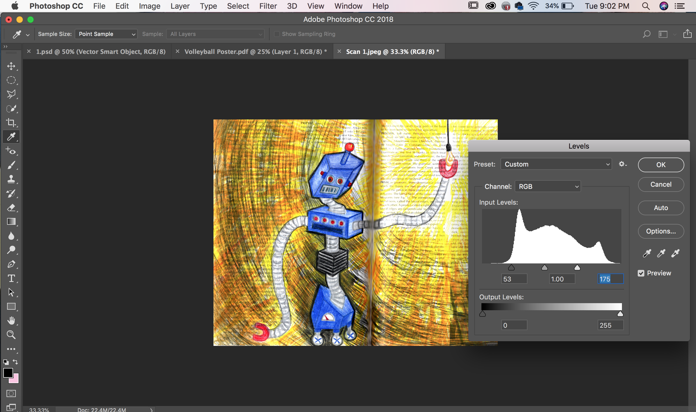
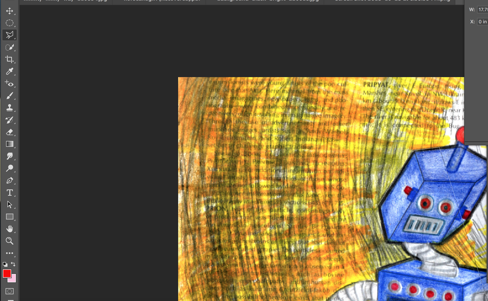
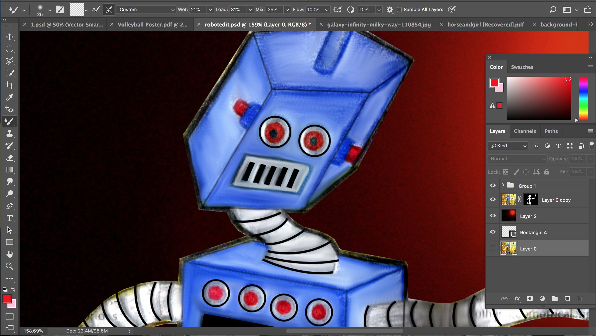
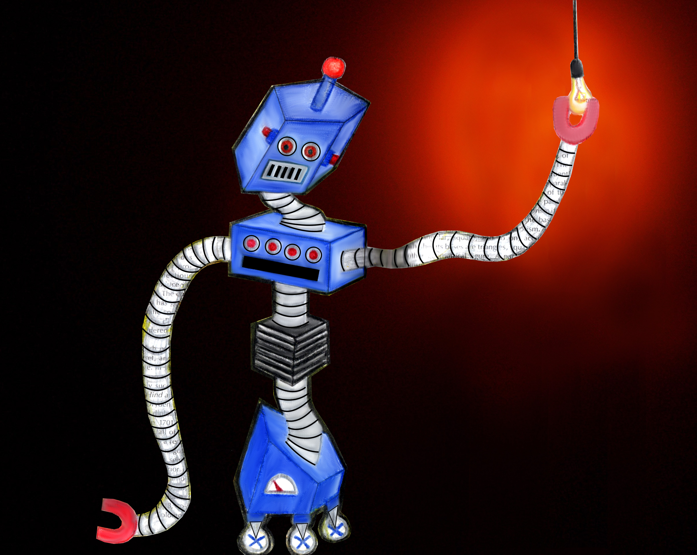

# Converting Sketches to Digital Art

Most illustrators today use tablets to create their masterpieces. Though, most artists find that it is refreshing to step away from the computer and revert back to pencil and paper for awhile. Something about the authenticity of sketching things out on a real piece of paper is so attractive. There's no reason an artist should ever have to choose between digital and authentic art, when they can have them both. There's actually a rather simple process that allows you to draw authentically on paper while still reaping the creative freedoms of Photoshop. Throughout this post I'm going to show you how I turn my sketches into finished digital artwork.

## Step 1

I start out by sketching in my sketchbook. Once I'm finished with my sketch, I place it on the scanner of my printer and scan it in for editing. (This is my scan)

## Step 2

Then, I crop my image down so that only the art work is showing and there is no more evidence of my sketchbook in the image. To crop an image in Photoshop, locate your crop tool (circled in red) and then size the picture down accordingly using the corner pieces displayed on your image.

## Step 3

Next, I work on the contrast of my image so that it doesn't look so gray. To do this I go to Image > Adjustments > Levels.

## Step 4

Adjust the sliders within the levels panel. You'll want to move the sliders on both ends closer towards the middle. This will make your whites whiter and your blacks blacker. The slider in the middle will adjust your mid-tones. I typically don't use that.

## Step 5

I decided I wanted to change up my background, so I cut out my robot with the polygon lasso tool so that I could place a different background behind him. (You don't have to do this) Once I found a background I liked, I just dragged it into Photoshop and placed it behind my robot layer.

## Step 6

After I got my background figured out, I worked on smoothing out my robot with the Mixer Brush tool so that he had more of a finished metal look. (You'll find the mixer brush tool underneath the regular paintbrush) The rest is simply preference. From here you can add more details, change colors, paint or draw in the background, etc. For my robot I chose to define some of his features more clearly with the pen tool, ellipse tool, and rectangle tool. For example, I used the ellipse tool to create black circles outlining the eyes.

## DONE!

